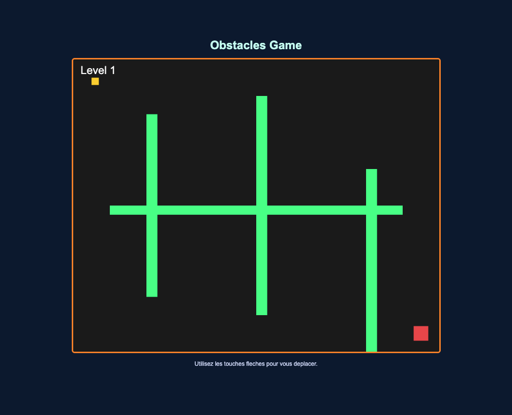

# Obstacles Game

## English

### Description

Obstacles Game is an engaging 2D game developed using JavaScript and the Canvas API. The player's objective is to navigate through different levels filled with moving and static obstacles to reach the exit. The game progressively increases in difficulty, challenging the player. Project is written with Vite.



### How to Play

- Use the **arrow keys** to move the player in four directions.
- Avoid **colliding** with obstacles, as they will prevent movement.
- Reach the **exit** to progress to the next level.
- Complete all levels to win the game.

### Features

- 4 challenging levels with different obstacle layouts.
- Different obstacles to test agility.
- Simple and intuitive controls.
- Minimalistic and dynamic design.

### Installation and Running

1. Clone the repository:
   ```sh
   git clone https://github.com/NikBud/Obstacles-Game.git
   ```
2. To launch the project you should write in terminal in root directory of projet:
   ```sh
   npm run dev
   ```

---

## Français

### Description

Obstacles Game est un jeu 2D captivant développé en JavaScript avec l'API Canvas. L'objectif du joueur est de naviguer à travers différents niveaux remplis d'obstacles statiques et mobiles afin d'atteindre la sortie. La difficulté augmente progressivement, mettant le joueur à l'épreuve. Le projet est développé avec Vite.

### Comment Jouer

- Utilisez les **flèches directionnelles** pour déplacer le personnage.
- Évitez les **collisions** avec les obstacles, sinon vous serez bloqué.
- Atteignez la **sortie** pour passer au niveau suivant.
- Terminez tous les niveaux pour gagner la partie.

### Fonctionnalités

- 4 niveaux stimulants avec différentes configurations d'obstacles.
- Différents obstacles pour tester l'agilité.
- Commandes simples et intuitives.
- Design minimaliste et dynamique.

### Installation et Exécution

1. Clonez le référentiel :
   ```sh
   git clone https://github.com/NikBud/Obstacles-Game.git
   ```
2. Pour lancer le projet, exécutez la commande suivante dans le terminal à la racine du projet :
   ```sh
   npm run dev
   ```

